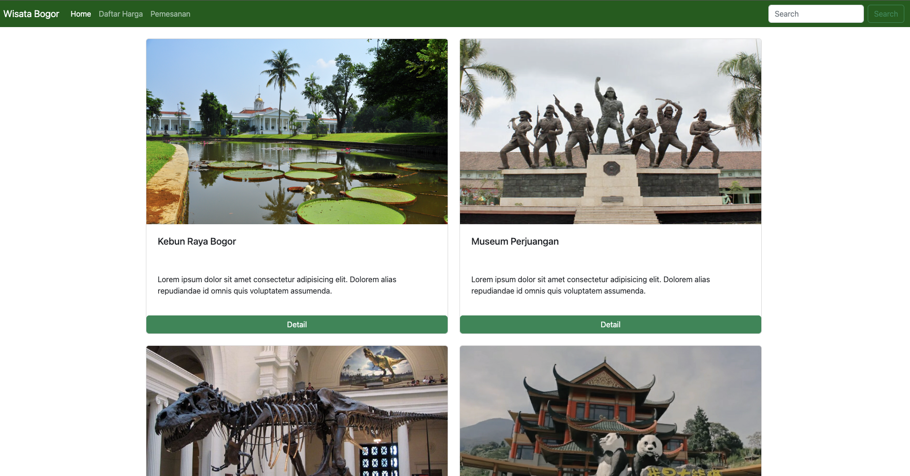
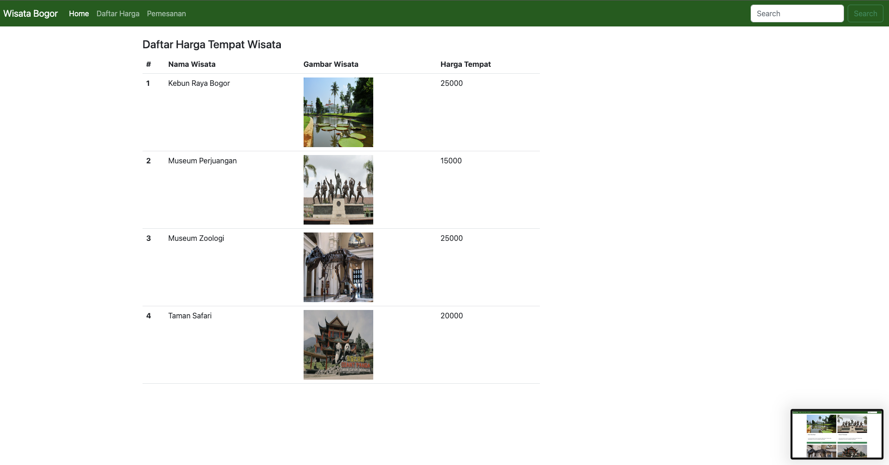
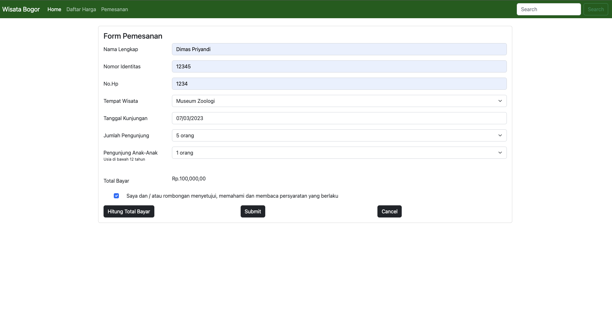

# Project Tiket Wisata Kota Bogor

## Struktur Hierarki Project
<pre>
├── api
│   └── read_wisata.php
├── config
│   └── connect.php
├── css
│   └── style.css
├── image
│   ├── kebun-raya-bogor.jpeg
│   ├── krb.jpeg
│   ├── museum_perjuangan.jpeg
│   ├── museum_zoologi.jpeg
│   └── taman_safari.png
├── js
│   └── script.js
├── 404.php
├── README.md
├── action_submit.php
├── daftar_harga.php
├── detail.php
├── footer.php
├── header.php
├── home.php
├── index.php
└── pemesanan.php
</pre>

## Tools 
* Visual Studio code
* Xampp 

## Language
* PHP 
* Mysql

## Output
 * Homepage
  
* Daftar Harga
 
* Pemesanan
 